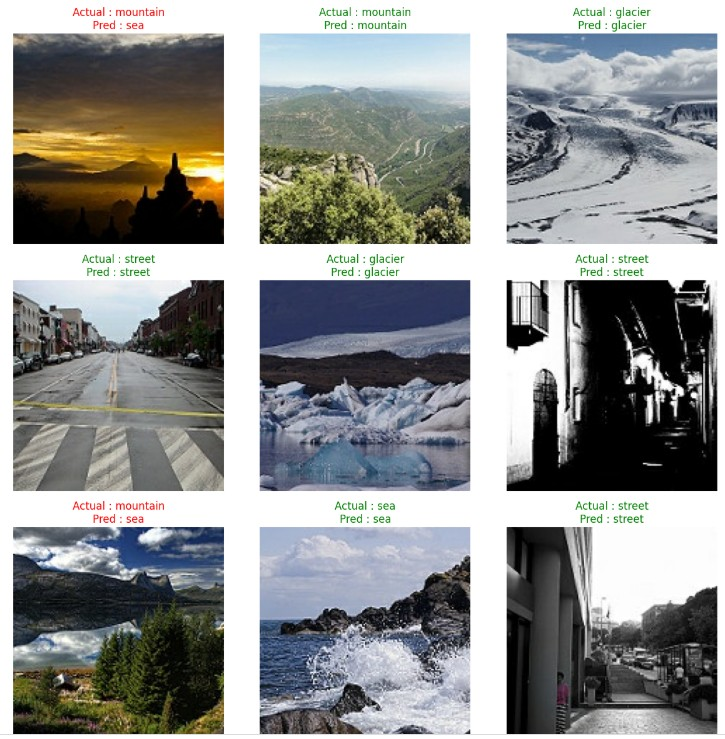

# Intel Image Classification using CNN

This project classifies natural scene images into six categories using a Convolutional Neural Network.
The dataset contains images of buildings, forests, glaciers, mountains, seas, and streets.
I built this as part of my deep learning coursework to understand how CNNs work on real-world image data.

## Dataset

The dataset used is the [Intel Image Classification](https://www.kaggle.com/datasets/puneet6060/intel-image-classification) dataset from Kaggle. It contains around 25,000 images of size 150x150 pixels, split into training, testing, and prediction sets. Each image belongs to one of six classes:

- Buildings
- Forest
- Glacier
- Mountain
- Sea
- Street


## Technologies Used

- Python 3.10
- TensorFlow / Keras
- NumPy
- Matplotlib
- Seaborn
- Scikit-learn
- Streamlit
- Jupyter Notebook

## Model Architecture

The model is a Convolutional Neural Network (CNN) with the following structure:

- **Rescaling Layer**: Normalizes pixel values from [0, 255] to [0, 1]
- **3 Convolutional Blocks**:
  - Conv2D (32 filters, 3x3 kernel) + MaxPooling2D + Dropout
  - Conv2D (64 filters, 3x3 kernel) + MaxPooling2D + Dropout
  - Conv2D (128 filters, 3x3 kernel) + MaxPooling2D + Dropout
- **Flatten Layer**
- **Dense Layer 1**: 128 units, ReLU activation + Dropout
- **Dense Layer 2**: 64 units, ReLU activation + Dropout
- **Output Layer**: Dense layer with 6 units (one for each class), Softmax activation

Input images are resized to 150x150 before feeding them into the model.

## Model Performance

I trained two versions of the model to compare their performance:

| Model | Test Accuracy | Test Loss |
|-------|-------------:|----------:|
| Base CNN | 81.56% | 0.53 |
| CNN + Batch Normalization | 53.70% | 1.00 |

The Base CNN was selected as the final model because it achieved better performance on the test dataset. The Batch Normalization version didn't converge well, probably due to the learning rate or the way I set up the layers.

## Dataset Samples


## Training Curves


## Sample Predictions



## Confusion Matrix


## Streamlit Application

A simple Streamlit app is included in the `app/` folder. You can upload any image and the model will predict which class it belongs to along with the confidence score.

### Live Demo
You can try out the live web app here: [Intel Image Classification App](https://intel-image-classification-cnn.streamlit.app/)

Here are some screenshots of the application predicting different classes:

### Forest Prediction


### Mountain Prediction


### Sea Prediction


### Street Prediction


To run the app locally:

```bash
cd app
streamlit run app.py
```

## How to Run

1. Clone the repository:

```bash
git clone https://github.com/geekyfromgreek/Intel-Image-Classification-CNN.git
cd Intel-Image-Classification-CNN
```

2. Install the required packages:

```bash
pip install -r requirements.txt
```

3. Make sure the trained model file (`intel_cnn_model.keras`) is placed inside the `app/` folder. You can copy it from the root directory:

```bash
cp intel_cnn_model.keras app/
```

4. Run the Streamlit application:

```bash
cd app
streamlit run app.py
```

## Future Improvements

- Try using data augmentation techniques like rotation, flipping, and zooming to improve accuracy.
- Train the model for more epochs or try a different architecture like ResNet or VGG.
- Collect more images per class to make the model more robust.

## License

This project is licensed under the MIT License. See the [LICENSE](LICENSE) file for details.
